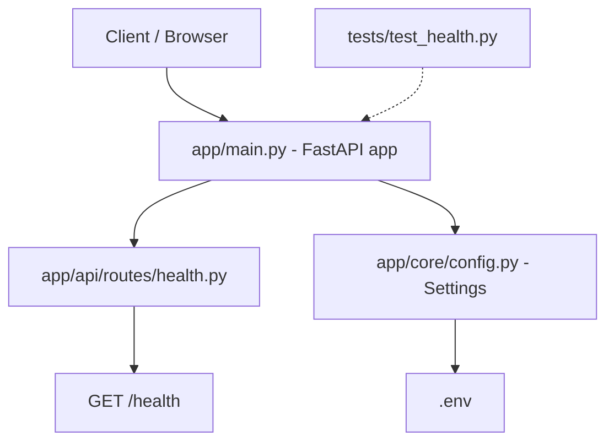

# Flow Diagram

This file tracks the architecture of the backend and a running log of changes.
It is updated every time the project structure, routes, or core logic change.

## Current Architecture



## Request Flow (example: /health)

1. Client sends `GET /health`
2. `app/main.py` routes the request to `app/api/routes/health.py`
3. `health_check()` returns `{"status": "ok"}`

## Project Structure

```
app/
├── main.py              # FastAPI app instance, includes routers
├── core/
│   └── config.py        # Settings (env vars via pydantic-settings)
├── api/
│   └── routes/
│       └── health.py    # /health endpoint
├── models/               # (empty) DB models go here
├── schemas/              # (empty) Pydantic request/response schemas
└── services/             # (empty) business logic
tests/
└── test_health.py        # tests /health endpoint
```

## Change Log

### 2026-08-15 — Initial scaffold
- Created FastAPI project structure (`app/`, `tests/`)
- Added `app/main.py` with FastAPI app instance
- Added `app/core/config.py` with `Settings` (env-driven via `.env`)
- Added `GET /health` route in `app/api/routes/health.py`
- Added `tests/test_health.py` (passing)
- Set up `venv`, installed fastapi, uvicorn, pydantic-settings, pytest, httpx
- Verified: tests pass, server boots, `/health` and `/docs` respond correctly
