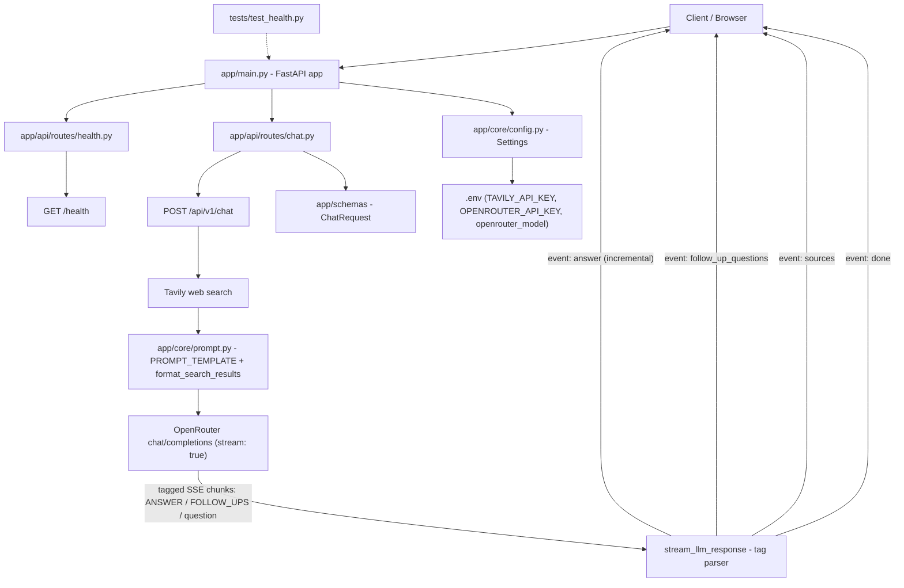

# Flow Diagram

This file tracks the architecture of the backend and a running log of changes.
It is updated every time the project structure, routes, or core logic change.

## Current Architecture



## Request Flow (example: /api/v1/chat)

1. Client sends `POST /api/v1/chat` with `{"query": "..."}`
2. `app/main.py` routes the request to `app/api/routes/chat.py`
3. `chat()`:
   - Reads `query` from the validated `ChatRequest` schema
   - Calls Tavily (`client.search`) to get web search results
   - Builds the LLM's user message via `PROMPT_TEMPLATE` (`USER_QUERY` + numbered `SEARCH_RESULTS`, formatted by `format_search_results`)
   - Builds a `sources` list (title + url) for citation display on the frontend
   - Returns a `StreamingResponse` (`text/event-stream`) backed by `stream_llm_response`
4. `stream_llm_response()`:
   - Sends `system` (`SYSTEM_PROMPT`) + `user` (built message) to OpenRouter with `"stream": true`
   - OpenRouter streams back the model's raw text, which itself is tagged: `<ANSWER>...</ANSWER><FOLLOW_UPS><question>...</question>...</FOLLOW_UPS>`
   - The parser accumulates the full raw transcript (never discards partial data, so a tag split across network chunks is never missed) and emits SSE events as soon as it's safe to do so:
     - `event: answer` — incremental text chunks as they're confirmed to be inside `<ANSWER>`
     - `event: follow_up_questions` — one JSON array, extracted from `<question>` tags, sent once the full response is in
     - `event: sources` — the Tavily-derived source list
     - `event: done` — signals the stream is complete
   - Logs the raw LLM output and the parsed follow-up questions, so any prompt/parsing mismatch is visible in the server log

## Project Structure

```
app/
├── main.py              # FastAPI app instance, includes health + chat routers
├── core/
│   ├── config.py        # Settings (env vars via pydantic-settings): tavily_api_key, openrouter_api_key, openrouter_model, etc.
│   └── prompt.py         # SYSTEM_PROMPT (tag-based output format), PROMPT_TEMPLATE, format_search_results
├── api/
│   └── routes/
│       ├── health.py    # /health endpoint
│       └── chat.py      # /api/v1/chat - Tavily search + streamed OpenRouter LLM call
├── models/               # (empty) DB models go here
├── schemas/
│   └── __init__.py       # ChatRequest (Pydantic request schema)
└── services/             # (empty) business logic
tests/
└── test_health.py        # tests /health endpoint
```

## Change Log

### 2026-08-15 — Initial scaffold
- Created FastAPI project structure (`app/`, `tests/`)
- Added `app/main.py` with FastAPI app instance
- Added `app/core/config.py` with `Settings` (env-driven via `.env`)
- Added `GET /health` route in `app/api/routes/health.py`
- Added `tests/test_health.py` (passing)
- Set up `venv`, installed fastapi, uvicorn, pydantic-settings, pytest, httpx
- Verified: tests pass, server boots, `/health` and `/docs` respond correctly

### 2026-08-16 — Chat endpoint: web search + LLM integration (Nugen, non-streaming)
- Moved the hardcoded Tavily API key out of `chat.py` into `.env`, read via `Settings.tavily_api_key`
- Fixed `app/core/prompt.py`: invalid multi-line `f"..."` string (syntax error), fixed a missing comma in the example JSON block
- Implemented the LLM call in `chat.py` against Nugen's `chat/completions` endpoint
- Fixed a pre-existing bug: relative imports in `chat.py` were missing a directory level (`..` instead of `...`)
- Registered the `chat` router in `app/main.py` (it existed but was never wired up)
- Updated `requirements.txt` to include `tavily-python`
- Switched the response format from JSON (`{"answer", "follow_up_questions"}`) to tagged plain text (`<ANSWER>`/`<FOLLOW_UPS>`), since JSON requires the full object to close before it can be parsed at all, and breaks easily if the model mis-escapes a quote/newline — tags can be scanned incrementally and don't need escaping

### 2026-08-16 (continued) — Streaming + provider switch to OpenRouter
- Rebuilt `chat.py`'s LLM call as a real SSE stream (`StreamingResponse`, `media_type="text/event-stream"`) instead of a single blocking request, so the frontend can render the answer as it's generated
- Replaced Nugen with **OpenRouter** as the LLM provider (`openrouter_api_key`, `openrouter_model` in `Settings`; default model `openai/gpt-4o-mini` — OpenRouter is OpenAI-compatible, so the existing SSE chunk parsing needed no changes)
- Fixed a real streaming bug: the original tag parser cleared its buffer on every chunk before checking for a partial closing tag, so a tag split across network chunks (e.g. `</ANSWER>` arriving as `.</`, `ANSWER`, `>` in separate chunks) leaked into the visible output and the parser never advanced past "answer" mode. Rewrote `stream_llm_response` to keep the full growing transcript and a "safe to emit" cursor, so partial tags are always held back correctly
- `prompt.py`'s `FOLLOW_UPS` section now wraps each question in `<question>...</question>`; updated the parser to extract via regex instead of raw line-splitting
- Added `format_search_results` + an updated `PROMPT_TEMPLATE` in `prompt.py` so Tavily's results are actually fed into the LLM prompt (previously fetched but unused), with inline `[n]` citation numbering
- Added a `sources` SSE event carrying `{title, url}` for each Tavily result, so the frontend can render citations
- Added logging (`Raw LLM output`, `Parsed follow-up questions`, OpenRouter response status/errors) so prompt/parsing issues are visible in the server log without cluttering the code
- Renamed the endpoint to **`POST /api/v1/chat`** (via `APIRouter(prefix="/api/v1")`)
- Code cleanup pass: condensed multi-line comments to one line, removed comments that just restated obvious code, tightened spacing, fixed `client.search(...)` call indentation, renamed `webSearchResults` → `web_search_results` (snake_case)
- Verified end-to-end: streamed real answer chunks, correct `follow_up_questions` array, `sources`, and `done` event, via the new `/api/v1/chat` path

**Still open (tracked as TODOs in `chat.py`):** credits/access check, caching web search results for repeat queries.
