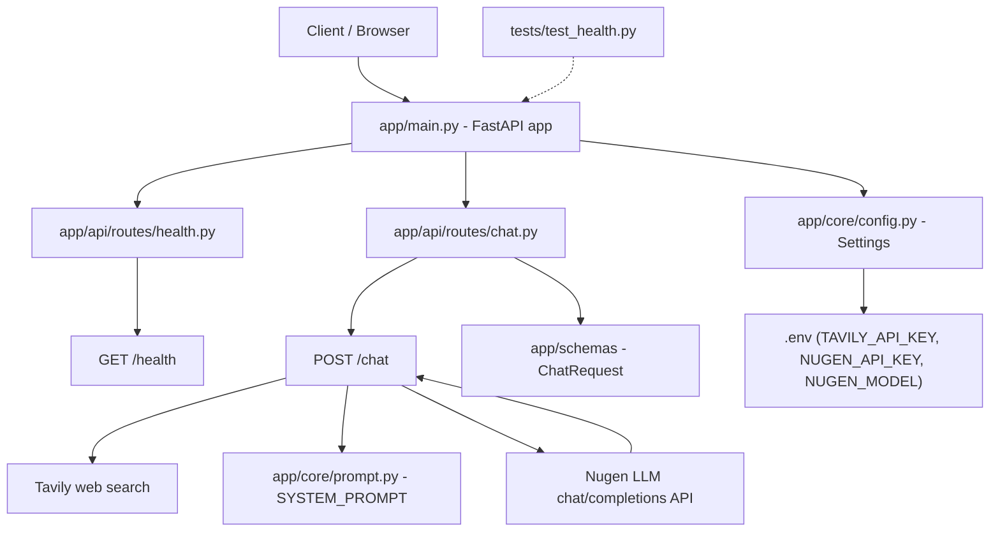

# Flow Diagram

This file tracks the architecture of the backend and a running log of changes.
It is updated every time the project structure, routes, or core logic change.

## Current Architecture



## Request Flow (example: /chat)

1. Client sends `POST /chat` with `{"query": "..."}`
2. `app/main.py` routes the request to `app/api/routes/chat.py`
3. `chat()`:
   - Reads `query` from the validated `ChatRequest` schema
   - Calls Tavily (`client.search`) to gather web search results (fetched, not yet fed into the prompt)
   - Sends a request to the Nugen LLM (`POST /api/v3/inference/chat/completions`) with a `system` message (`SYSTEM_PROMPT`) and a `user` message (the query)
   - Returns the raw LLM response JSON to the client

## Project Structure

```
app/
├── main.py              # FastAPI app instance, includes health + chat routers
├── core/
│   ├── config.py        # Settings (env vars via pydantic-settings): tavily_api_key, nugen_api_key, nugen_model, etc.
│   └── prompt.py         # SYSTEM_PROMPT + PROMPT_TEMPLATE used to instruct the LLM
├── api/
│   └── routes/
│       ├── health.py    # /health endpoint
│       └── chat.py      # /chat endpoint - web search (Tavily) + LLM call (Nugen)
├── models/               # (empty) DB models go here
├── schemas/
│   └── __init__.py       # ChatRequest (Pydantic request schema)
└── services/             # (empty) business logic
tests/
└── test_health.py        # tests /health endpoint
```

## Change Log

### 2026-08-15 — Initial scaffold
- Created FastAPI project structure (`app/`, `tests/`)
- Added `app/main.py` with FastAPI app instance
- Added `app/core/config.py` with `Settings` (env-driven via `.env`)
- Added `GET /health` route in `app/api/routes/health.py`
- Added `tests/test_health.py` (passing)
- Set up `venv`, installed fastapi, uvicorn, pydantic-settings, pytest, httpx
- Verified: tests pass, server boots, `/health` and `/docs` respond correctly

### 2026-08-16 — Chat endpoint: web search + LLM integration
- Moved the hardcoded Tavily API key out of `chat.py` into `.env` (`TAVILY_API_KEY`), read via `Settings.tavily_api_key`
- Fixed `app/core/prompt.py`: `SYSTEM_PROMPT` was an invalid multi-line single-quoted `f"..."` string (syntax error); converted to a plain triple-quoted string, removed stray characters, and fixed a missing comma in the example JSON block
- Added `nugen_api_key` and `nugen_model` to `Settings`, and `NUGEN_API_KEY` to `.env`
- Implemented the actual LLM call in `chat.py`: `POST` to Nugen's `chat/completions` endpoint with `system` (`SYSTEM_PROMPT`) + `user` (the query) messages, returning the LLM's response
- Fixed a pre-existing bug: relative imports in `chat.py` (`from ..schemas...`, `from ..core...`) were missing a directory level and would have failed at runtime; corrected to `from ...schemas...`, `from ...core...`
- Registered the `chat` router in `app/main.py` (it existed but was never wired up, so `/chat` was unreachable)
- Updated `requirements.txt` to include `tavily-python`
- Verified end-to-end: `POST /chat {"query": "What is the capital of France?"}` → real Tavily search + real Nugen LLM call → `200 OK` with a correct answer

**Still open (tracked as comments in `chat.py`):** credits/access check, search-result caching, feeding `webSearchResults` into the LLM prompt, streaming the response, and a parallel follow-up-questions call.
